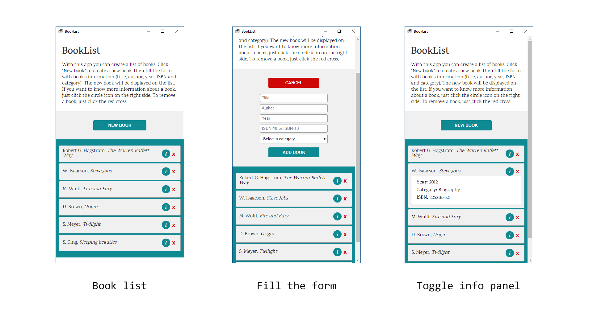
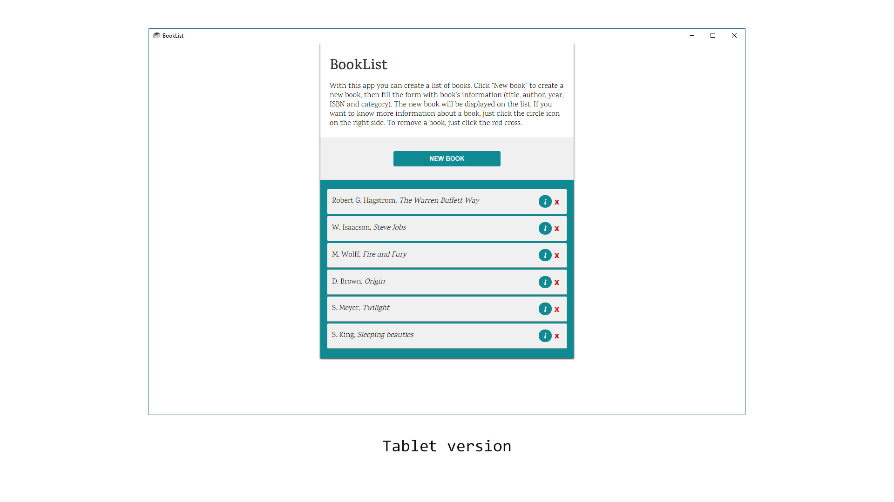

# BookList
This app allows you to create a list of books. Click "New book", fill the form and then the book will be added to the list. The list is immediately updated and displayed below the form.

## How it works
To add book, you need to provide the title, the author, the year, the ISBN code and the category. If some inputs are invalid, the system will tell you what's wrong. The new book is added on top of the list, and you can see more information by clicking the blue-green button on the right. You can also remove a book from the list by clicking the red cross.

## Technologies
This app is made with HTML5, CSS3 and JavaScript. To store the book list, I used the HTML5 localStorage. In this way, the data persist even if the page is reloaded. I didn't use any external library, such as jQuery or Bootstrap. The interface is responsive, but the layout is vertical for both mobile and desktop screen. The main goal of this project was to practice some JavaScript and understand how localStorage works.

## Images

